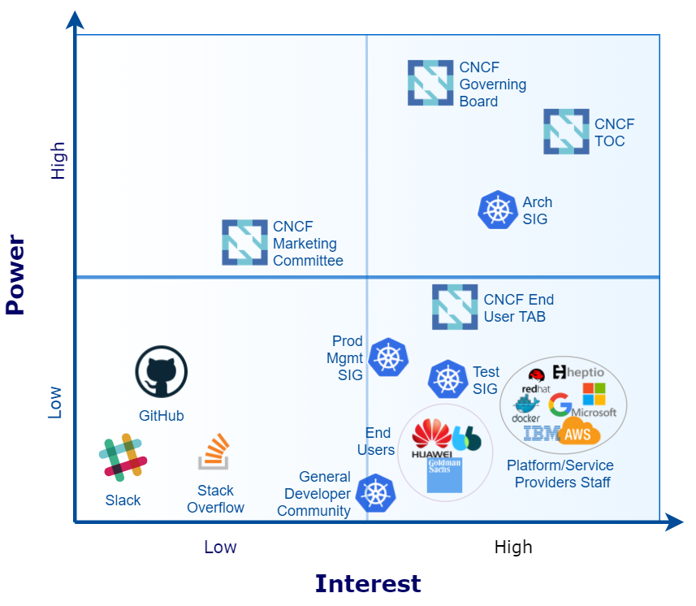
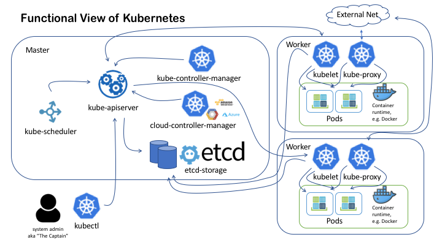
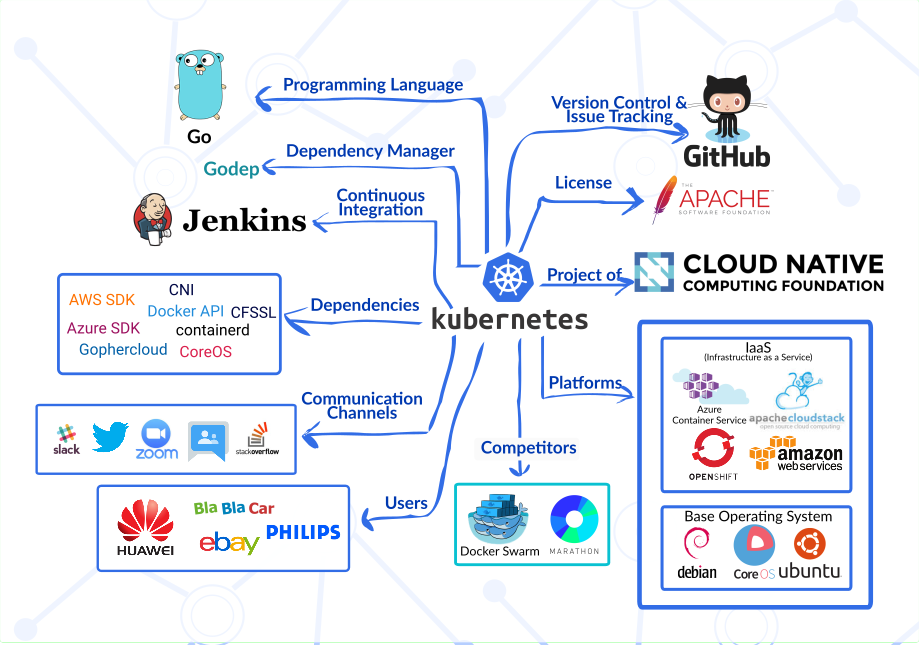
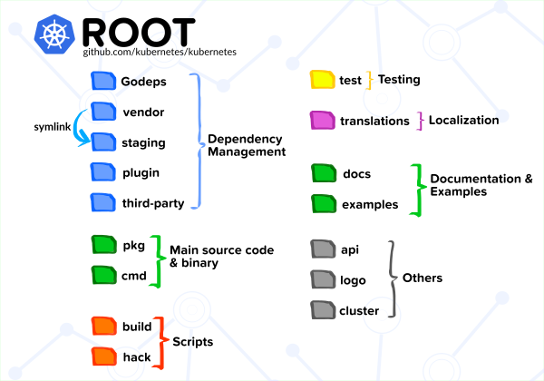
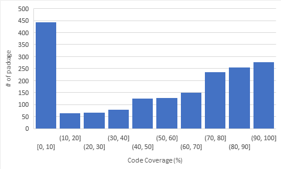
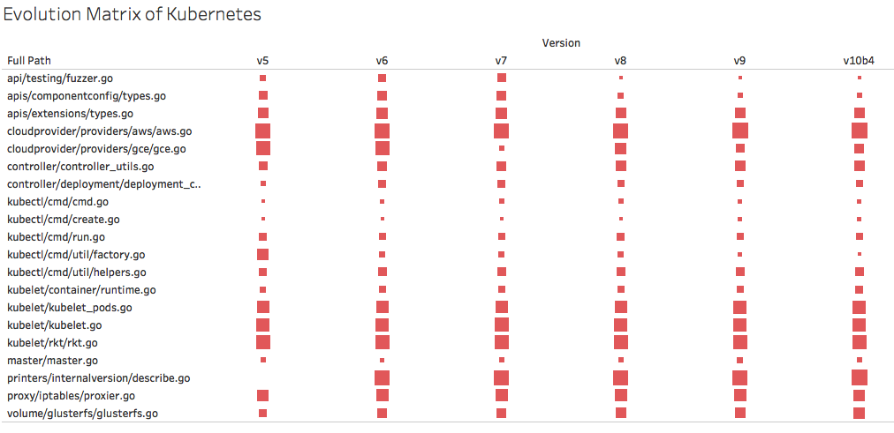

# Kubernetes - Container Orchestration
**By [Enreina Annisa Rizkiasri](https://github.com/enreina), [Francisco Morales](https://github.com/nidorano), [Haris Suwignyo](https://github.com/harissuwig), and [Mohammad Riftadi](https://github.com/riftadi).**
*Delft University of Technology*

### Table of Contents

- [Introduction](#introduction)
- [Stakeholders](#stakeholders)
- [Functional View](#functional-view)
- [Context View](#context-view)
- [Development View](#development-view)
- [Evolution Perspective](#evolution-perspective)
- [Technical Debt](#technical-debt)
- [Conclusion](#conclusion)
- [References](#references)

## Introduction

[Kubernetes](https://kubernetes.io/) is an open source system for managing containerized applications across multiple hosts; providing basic mechanisms for deployment, maintenance, and scaling of applications [[1]](#ref1). After Google and the Linux Foundation established a partnership and announced Kubernetes 1.0 in 2015, Kubernetes was taken as the flagship project under the umbrella of the [Cloud Native Computing Foundation](https:///www.cncf.io) (CNCF) [[2]](#ref2). Nowadays, it is one of the most used orchestration system for containerized applications, with a large base of users, partners, and an active development community.

Kubernetes provides a centralized management environment for containers, microservices, and cloud platforms. It orchestrates computing, networking, and storage infrastructure on behalf of the user. Thus, it combines the simplicity of Platform as a Service (PaaS) with the flexibility of Infrastructure as a Service (IaaS), enabling portability across infrastructure providers.

In this chapter, we cover who is involved in the development and growth of Kubernetes; we describe its context view and its functional building blocks.  Afterwards, we dive into the development practices inside Kubernetes, describing its module organization and common designs. We also analyze the presence of technical debt in Kubernetes project and how it has evolved. Finally, we present our conclusions regarding the architecture of this project. 

## Stakeholders

### Identifying Stakeholders

In order to understand the stakeholders' interests around such a large project as Kubernetes, it is necessary to introduce the [Cloud Native Computing Foundation](www.cncf.io) (CNCF) first. CNCF was born from a partnership between Google and the Linux Foundation when Kubernetes 1.0 was announced in 2015 and considered as its flagship [[3]](#ref3). Since then, many cloud computing and IT industry players plus other related organizations have joined CNCF to incubate, develop, and maintain an ecosystem of cloud projects under a shared, common vision. CNCF members are distributed in Platinum, Gold, Silver, End-User, Academic and Non-profit membership levels. Leading CNCF members, which include Google, Docker, IBM, VMware, Cisco, Red Hat, and Oracle, own a Platinum membership among others.

To identify Kubernetes stakeholders, we follow the categories from the book Software Systems Architecture by Nick Rozanski and Eoin Woods [[4]](#ref4). The main Kubernetes stakeholders are found as part of the CNCF or the Kubernetes general community. [CNCF's charter](https://www.cncf.io/about/charter/) defines several organization divisions with representatives from different CNCF members. Stakeholders' roles can be matched to these organization divisions and to other groups derived from the CNCF members and the general Kubernetes community as described next.

There are three high-level divisions inside CNCF, which is a key aspect of stakeholder identification: Governing Board, Technical Oversight Committee (TOC), and the End User Technical Advisory Board (TAB). The Governing Board (**Acquirer, Assessor**, mostly formed by Platinum CNCF members) is responsible for budget decisions, marketing (**Communicator**, through a Marketing Committee), and defining and enforcing policies regarding the use of trademarks and copyrights of the foundation.  The Technical Oversight Committee (**Assessor**) is expected to define and maintain the technical vision for the CNCF, align, remove or archive projects, define common practices to be implemented across CNCF projects, among other duties. The End User TAB (**User**) receives the input from the End User community (CNCF members and no members) to coordinate and drive activities important to the users and consumers of CNCF projects. Some specific Kubernetes end users include Huawei, Bla Bla Car, ebay, Goldman Sachs, and Philips [[5]](#ref5).

Besides CNCF organizations, Kubernetes attracts thousands of contributors worldwide which coordinate their efforts through online platforms like [Github](https://github.com/kubernetes/kubernetes), [Slack](http://slack.k8s.io/), and [StackOverflow](https://stackoverflow.com/questions/tagged/kubernetes) (**Suppliers**). Kubernetes' development is in charge of Special Interest Groups (SIG).  SIGs range from [Architecture](https://github.com/kubernetes/community/blob/master/sig-architecture) (**Maintainer**, ensures architectural consistency over time), [Product Management](https://github.com/kubernetes/community/blob/master/sig-product-management) (**User**, manages user requests and feedback), [testing](https://github.com/kubernetes/community/blob/master/sig-testing/README.md) (**Tester**), to specific implementations for service providers like [AWS](https://github.com/kubernetes/community/blob/master/sig-aws/README.md), [GCP](https://github.com/kubernetes/community/tree/master/sig-gcp), [Azure](https://github.com/kubernetes/community/blob/master/sig-azure) (**Production Engineers**, **Support Staff**, and **System Administrators** often belong to service providers).

Based on the number of commits, we have identified the top 5 developers on Github:  

- [smarterclayton](https://github.com/smarterclayton),
- [brendandburns](https://github.com/brendandburns),
- [wojtek-t](https://github.com/wojtek-t),
- [deads2k](https://github.com/deads2k), and
- [caesarxuchao](https://github.com/caesarxuchao).

### Other Stakeholders

[Table 1](#tab1) identifies four special types of Kubernetes stakeholders [[6]](#ref6).

<a id="tab1">

_**Table 1**_. Kubernetes special stakeholders

| Stakeholder Type                    | Description                                                  |
| ----------------------------------- | ------------------------------------------------------------ |
| Certified Service Providers         | Service providers with deep experience helping enterprises successfully adopt Kubernetes. E.g. [Accenture](https://www.accenture.com/us-en/service-application-containers) |
| Certified Platforms & Distributions | Software conformance ensures that every vendor’s version of Kubernetes supports the required APIs. E.g. [Cisco](https://www.cisco.com/) |
| Technology Partners                 | Integrations and plugins that add features to Kubernetes applications. E.g. [Aporeto]() |
| Service Partners                    | Consulting or management services to help companies implement Kubernetes in commercial applications. E.g. [NebulaWorks](https://www.nebulaworks.com/container-platforms) |

### Power vs Interest Grid

[Figure 1](#fig1) shows the Power vs Interest grid, which divides the stakeholders in four categories:

_**Figure 1.**_ Power vs Interest Grid

- **High power and high interest** : Given that the CNCF Governing Board manages budget matters there is no doubt it has the maximum power on its projects, followed by the CNCF TOC, with the attribution to add and remove projects such as Kubernetes.  Considering Kubernetes exclusively, the Architecture SIG is key because it decides the future of the project.
- **High power and low interest** : The CNCF Marketing Committee, derived from the CNCF Governing Board, takes care of the project brands and other business-related activities. 
- **Low power and high interest** : Compared to the stakeholders with high power over Kubernetes, the CNCF End User TAB, platform/service providers staff, Test SIG, and Kubernetes general developer community depend on the continuous development of the project, what involves a high interest. 
- **Low power and low interest** : Coordination platforms (e.g. GitHub) have little power and interest over the project given that other platforms could serve a similar purpose if they were not taken into account.

### Analysis of Issues and PRs

After analyzing recent issues and Pull Requests (PRs), we obtained useful insight about Kubernetes project. For instance, Kubernetes already has a sophisticated method on working with issues and PRs: it uses templates, labels according problem domain and size, automated code checking tools, or bots for tracking. Moreover, SIGs elect their leaders democratically, while holding responsibility and autonomy. Every contributor must follow canonical principles like design security from ground-up or do unit tests. However, this complexity introduces a steep learning curve for new contributors in spite of existing documentation. 

### Integrators

Kubernetes project has a well-defined procedure to modify its code. New code is merged only if **approvers** agree with the modifications. Consequently, **approvers** are the **integrators**. The main Kubernetes repository integrators include [[7]](#ref7): 

- [bgrant0607](https://github.com/bgrant0607)
- [brendandburns](https://github.com/brendandburns)
- [dchen1107](https://github.com/dchen1107)
- [jbeda](https://github.com/jbeda)
- [monopole](https://github.com/monopole)

### Contacts

_**Table 2**_. Contact list

|                             SIG                              | Contacts                                                     | Why?                                                         |
| :----------------------------------------------------------: | ------------------------------------------------------------ | ------------------------------------------------------------ |
| [Architecture](https://github.com/kubernetes/community/blob/master/sig-architecture/README.md) | [bgrant0607](https://github.com/bgrant0607), [jdumars](https://github.com/jdumars) | They are the Kubernetes Architects.                          |
| [Contributor Experience](https://github.com/kubernetes/community/tree/master/sig-contributor-experience) | [Phillels](https://github.com/Phillels), [parispittman](https://github.com/parispittman) | Their main purpose is to keep the contributors "happy and productive". |
|                              -                               | Experienced contributors (e.g. [nikhita](https://github.com/nikhita)) | They actively participate on communication channels (e.g. [Slack](https://kubernetes.slack.com/threads)). They enjoy sharing ideas and solve newcomers' doubts. |

## Functional View

Kubernetes services are organized into two primary functions: master and worker services. [Figure 2](#fig2) shows a high-level diagram of Kubernetes Functional View.

_**Figure 2.**_ Kubernetes Functional View

This subsection is derived from the official Kubernetes Components document [[8]](#ref8).

### Master Node Components
The master node is responsible for managing the whole Kubernetes cluster. It provides the main interface for the user to interact with the system. Conceptually, there should be no container service running on the master node.

#### kube-apiserver
The `kube-apiserver` provides REST API service to interact with other components of the system. It processes every REST API request, validates it, and finally instructs the appropriate service to execute it. It employs `etcd-storage` as its persistent storage component.

#### etcd-storage
The master node uses [etcd](https://github.com/coreos/etcd) to store its states, for example jobs being scheduled, created and deployed; pod details and state; namespace and replication information; and so on.

#### kube-scheduler
The scheduler is responsible for finding the most suitable node for a pod or service to run, based on some constraints. By default, it tries to balance out the resource utilization of nodes [[9]](#ref9). It also watches resources available on all members of the cluster.

#### controller-manager
The controller manager is a process that encapsulates various controllers. In Kubernetes, a controller is defined as a control loop that watches the shared state of the cluster through the `kube-apiserver` and makes necessary changes to move the current state towards the desired state. It is organized into 2 modules: Kubernetes and cloud controller-manager.

#### kubectl
While technically `kubectl` is not a part of the master node, it is worth mentioning here as it is used to interact with the master node. `kubectl` is a command line interface for running commands against Kubernetes clusters. It communicates with the `kube-apiserver` via REST API service.

### Worker Node Components
A Kubernetes worker node contains three main elements to be able to run appropriate containers inside the worker nodes. The elements are: `kubelet`, `kube-proxy`, and container runtime.

#### kubelet
`kubelet` is a service responsible for communicating with the master node and interacts with the container runtime service to run a Kubernetes pod. It gets the descriptive configuration of a pod from the `kube-apiserver` via REST API, then instructs the container runtime service to run the appropriate containers.

#### kube-proxy
`kube-proxy` is responsible for manageing network services in worker node, e.g. the exposure of network ports to the outside world, load balancing inbound traffic.

#### Container runtime
The container runtime is the software that is responsible for running containers. Kubernetes supports several runtimes: [Docker](http://www.docker.com/), [rkt](https://coreos.com/rkt/), [runc](https://github.com/opencontainers/runc) and any OCI [runtime-spec](https://github.com/opencontainers/runtime-spec) implementation.

# Context View

In this section, the scope of Kubernetes and its interaction with its surrounding environments are explained. The section consists of what the system does and does not do and also external entities that the system interacts with.

## System Scope

Kubernetes is a container orchestration tool which is a system for managing containerized application [[10]](#ref10). The main tasks of Kubernetes are **deployment**, **scaling**, and **management** of containerized application. Each role is defined as follows.
- **Deployment**: manages the deployment of application by assigning application instances onto Nodes in a cluster
- **Scaling**: scale the application to keep up with user demand by adjusting cluster size and number of pod replicas
- **Management**: provide interface for managing the cluster and its containerized application

## External Entities

The relationship between Kubernetes and its external entities are summarized in [Figure 3](#fig3):

_**Figure 3.**_ Context Model

We will discuss some of the entities regarding their relation with four focuses of the system: stakeholders, development, platforms, and competitors.

### Stakeholders

In relation to the stakeholders discussed in the previous section, the context model includes interfaces between the Kubernetes system and some stakeholders. In this case, there are stakeholders entities: **CNCF** as the supervisor of the project which was listed as the acquirer, **GitHub** as a supplier, and some companies who uses Kubernetes in their system such as **Huawei**, **BlaBlaCar**, **eBay**, and **Philips** [[5]](#ref5).

### Development

The **Go** programming language is the main language used in Kubernetes development. Also, Kubernetes depends on several external libraries such as the **AWS SDK**, **Container Network Interface (CNI)**, **Docker API**, **Azure SDK**, and **Gophercloud**. Additionaly, Kubernetes is developed using **GitHub** for version controling and **Jenkins** for managing continuous integration.

### Platforms

Kubernetes acts as a portable cloud platform and can run on various platforms [[11]](#ref11). Their documentation provides some extensive list of Infrastructure-as-a-Service (IaaS) providers that Kubernetes is compatible with. The list includes **Azure Container Service**, **Amazon Web Service (AWS)**, and **OpenShift**. Kubernetes communicates with those platforms with their respective SDK.

### Competitors

Two of notably known competitors who also serve as a container orchestration tool are the **Docker Swarm** and Mesosphere's **Marathon**. **Marathon** is the orchestration platform for [Apache Mesos](https://mesos.apache.org/), while [Docker Swarm](https://docs.docker.com/swarm/overview/) (now integrated into Docker system as the *Swarm Mode*) is the native clustering for orchestrating Docker containers. 

## Development View

### Module Organization

Kubernetes source code is organized into layers of modules based on its functionality. The general overview of the partition of the modules is shown in [Figure 4](#fig4).

_**Figure 4.**_ Kubernetes Module Organization

The layers and their functions description in this subsection are derived from the architectural roadmap of Kubernetes [[12]](#ref12).

#### The Nucleus: API and Execution

The nucleus contains the minimum set of features needed to build the higher layers of the system and is composed of API and Execution modules. API modules provide a collection of REST APIs and the execution modules of Kubernetes are responsible for executing application within containers. The most important execution module in Kubernetes is [`Kubelet`](https://kubernetes.io/docs/admin/kubelet/).

#### The Application Layer: Deployment and Routing

The application layer provides self-healing, scaling, application lifecycle management, service discovery, load balancing, and routing. Further, the deployment module provides container-centric methods and lifecycle controllers to support orchestration, while the routing module provides scheduling service.

#### The Governance Layer: Automation and Policy Enforcement

This layer contains the automation module which provides automatic scaling of the cluster and automatic provisioning of nodes. The policy enforcement module provides means to configure and discover default policies for the cluster.

#### The Interface Layer: Libraries and Tools

This layer contains commonly used libraries, tools, systems, and UIs in Kubernetes project. One of the most important tools in this layer is [`kubectl`](https://kubernetes.io/docs/reference/kubectl/overview/). It also contains other client libraries such as client-go and client-python.

#### The Ecosystem

This layer is not really part of Kubernetes, but it provides functionality commonly needed to deploy and manage containerized applications. The most popular example of this supporting layer is Docker, which runs the actual container in nodes. Modules used to communicate with cloud provider also belong here.

### Common Design Model
In this section, we will look at the common design models that Kubernetes developers can refer to. We looked at the common processing, design standardization, and testing standardization that Kubernetes developer teams have. According to [[4]](#ref4), these common design models can be used so that the system is easy to understand, operate, and maintain .

#### Common Processing
In the development of Kubernetes, there is a common processing across different elements in order to simplify cross-element integration of code units. Two of the most important common processing elements are instrumentation and logging. They are part of the Kubernetes developer guide [[13]](#ref13).

Through instrumentation, we can measure the performance of a certain metric. The ability of a system to do instrumentation can help developers during the development. Kubernetes follows the general Instrumentation advice from the [Prometheus Go client library](https://github.com/prometheus/client_golang) [[14]](#ref14). According to the Kubernetes's instrumentation guide [[15]](#ref15), Kubernetes added an extra convention on instrumentation, mainly the naming of the metrics. The naming of a metric should be as follow: `<<component_name>>_<metric>`. This is done to avoid collisions of metrics between the components since sometimes the measurement of one metric is done in several components.

The other way to understand the performance and real way of working of our system is by logging. Logging is one of the common design models that are essential for developers during development to ensure that the system worked as intended and can be understood by another developer. Logging is also useful during debugging to know the error encountered during the build. According to the logging convention [[16]](#ref16), Kubernetes uses the built-in [glog](http://godoc.org/github.com/golang/glog) logging function in Golang. The logs provided by glog are standard, such as error log, warning log, and info log.

#### Design Standardization
To ensure a project to be maintainable, cohesive, and easy to reproduce, developers that are working on the project need to adhere to a certain design standard. Since Kubernetes has a variety of developers who intend to contribute to the project, the Kubernetes team formulated a design standardization for the coding, which is stated in the Coding Conventions document [[17]](#ref17). Since Kubernetes is developed using Go language, the main coding conventions that Kubernetes developers have to adhere is the Effective Go guideline [[18]](#ref18). Developers also have to avoid Go landmines to ensure the effectiveness of the code [[19]](#ref19). Several other code conventions include code commenting, command-line flags, naming, and other conventions, such as API and logging conventions [[16]](#ref16)[[20]](#ref20).

### Codeline Model

_**Figure 5.**_ Source Code Structure

The overall Kubernetes project's source code structure is depicted in [Figure 5](#fig5). Kubernetes is developed on top of packages. The main packages are organized inside the `pkg` folder, while dependencies on the external package are managed by [Godep](https://github.com/tools/godep).

The description of each category illustrated in [Figure 5](#fig5) is covered in more detail in [Table 3](#tab3).

_**Table 3**_. Source Code Structure

| Category | Description                                    |
|-----------|------------------------------------------------|
| Dependency Management | This category mainly consists of folders generated by Godep. The `vendor` folder also contains packages from Kubernetes external repository. These packages are symlinked to the `staging` folder for development purposes. |
| Main Source Code & Binary | The `pkg` folder is where all source code is organized in multiple packages. There is also the `cmd` folder containing binaries (source code for main executables).|
| Scripts | Scripts for automating build process are stored in `build` folder, while `hack` folder contains shell (`.sh`) scripts for development automation. |
| Testing | For unit and integration testing purposes. |
| Localization | Contains translations to multiple languages for messages shown by `kubectl`.|
| Documentation & Examples | Contains documentation for `kubectl`, API reference, and some examples of how to run real applications in Kubernetes. |
| Others | This category includes miscelaneous stuff such as API specification, logo images, and the deprecated `cluster` folder. |

Additionally, [Table 4](#tab4) lists the code structure inside the `cmd`, describing how main executables source code is organized. The related package (from the `pkg` folder) used by the respective executables is also listed in the table.

_**Table 4**_. Folders under `cmd`

| Directory | SIG Owner| Description | Related Package |                                   
|-----------|----------|-------------|-----------------|
| `clicheck` | | common CLI checking | `pkg/kubectl`|
| `cloud-controller-manager` | [sig-api-machinery](https://github.com/kubernetes/community/blob/master/sig-api-machinery/README.md) | External controller manager for running cloud specific controller loops | `pkg/cloudprovider`
| `hyperkube` | [sig-release](https://github.com/kubernetes/community/tree/master/sig-release)| An executable that can morph into other kubernetes binaries | `pkg/kubectl` |
| `kube-apiserver` | [sig-api-machinery](https://github.com/kubernetes/community/blob/master/sig-api-machinery/README.md) | Main api server and master for the cluster | `pkg/kubeapiserver`
| `kube-controller-manager` | | Monitoring replication controllers | `pkg/cloudprovider`, `pkg/controller`|
| `kube-proxy` | | For managing proxy server between localhost and API server | `pkg/apis`,`pkg/kubelet`, `pkg/proxy`, `pkg/master`|
| `kube-scheduler` | [sig-scheduling](https://github.com/kubernetes/community/tree/master/sig-scheduling) | Scheduler for assigning nodes to pods | `pkg/scheduler`
| `kubeadm` | [sig-cluster-lifecycle](https://github.com/kubernetes/community/tree/master/sig-cluster-lifecycle) | Toolkit to setup Kubernetes cluster | `pkg/api`
| `kubectl` | [sig-cli](https://github.com/kubernetes/community/blob/master/sig-cli/README.md) | Main CLI for running commands against clusters | `pkg/kubectl` |
| `kubelet` | [sig-node](https://github.com/kubernetes/community/tree/master/sig-node) | Maintaining a set of containers on a particular host VM. | `pkg/kubelet`
| `kubemark` | [sig-scalability](https://github.com/kubernetes/community/tree/master/sig-scalability) | Performance testing tool | `pkg/kubemark`|

## Evolution Perspective

Since the first commit at GitHub on June 7, 2014, Kubernetes has evolved throughout the years, having a lot of new feature being added to the system and bug being fixed. In this section, we look at the evolution of the Kubernetes software throughout its development. 

Kubernetes project was first developed by Google. The project was heavily influenced by Borg, a similar project at Google, and was made open-source [[21]](#ref21) [[22]](#ref22). Kubernetes follows the semantic versioning convention [[23]](#ref23) when releasing an update, that is Kubernetes `vX.Y.Z` where `X` denotes a major release, `Y` denotes a minor release, and `Z` denotes a patch release. 

Before the first major release of Kubernetes `v1.0.0`, the project was still not ready for use in production. The project was released on a bi-weekly basis up until `v0.21.0`, which was released on July 8, 2015, and every minor release has new features being added, such as AWS support in the `v0.5.0` release and Kubernetes UI with dashboard components in the `v0.16.0` release.

When the first major `v1.0.0` of Kubernetes was released in July 13, 2015, Google ceded the control over the project to Cloud Native Computing Foundation (CNCF) and the software is considered ready for use in production environment [[24]](#ref24). After this major release, the project was released on a quarterly basis every year. Some of the most notable releases were [[25]](#ref25):
1. `v1.2.0`: The introduction of Special Interest Group (SIG) in the project and the scaling improvements where at that version, Kubernetes could support up to 1000 nodes.
2. `v1.5.0`: Simplification of cluster deployment and Windows Server Container support.
3. `v1.6.0`: Migration to etcd v3 which can support up to 5000 nodes and overall improved documentation of the project through the [Community Repository](https://github.com/kubernetes/community).
4. `v1.7.0`: Security enhancement such as node authorizer and TLS certificate rotation; and added internationalization support for the Chinese and Japanese language.
5. `v1.8.0`: Improved workload API to support Apache Spark.

The most recent version of Kubernetes, up to the time of writing, is the `v1.10.0` release. Besides the new features and bug fixes on each release, Kubernetes also improves its documentation and its product management through separate repositories such as [Community](https://github.com/kubernetes/community), [SIG-Release](https://github.com/kubernetes/sig-release/), and [Features](https://github.com/kubernetes/features) so that the development of Kubernetes is more organized.

## Technical Debt

In this section, we look at all possible sources of technical debt in Kubernetes project. We have performed several types of analysis, which are the analysis of general technical debt as well as specific testing debt and historical analysis.

### Manual Identification

As part of the analysis of Kubernetes technical debt, we manually skimmed the Kubernetes's GitHub repository and the code structure looking for technical debt traces. We found that Kubernetes community members are familiar with the terminology and are aware of some areas concerning this technical debt as there are issues specifically labelled as [`kind/technical-debt`](https://github.com/kubernetes/kubernetes/labels/kind%2Ftechnical-debt) such as scheduling ([58346](https://github.com/kubernetes/kubernetes/issues/58346), [56236](https://github.com/kubernetes/kubernetes/issues/56236)) and api-machinery ([54511](https://github.com/kubernetes/kubernetes/issues/54511), [44263](https://github.com/kubernetes/kubernetes/issues/44263)) issues. These issues date as far back as 2015, which means that technical debt exists and the project maintainers make efforts to manage and deal with technical debt in one way or another. Besides that, a quick search through the code reveals many TODO comments regarding work that is still required inside several source code files, some of them as important as [kubelet.go](https://github.com/kubernetes/kubernetes/blob/master/pkg/kubelet/kubelet.go), [master.go](https://github.com/kubernetes/kubernetes/blob/master/pkg/master/master.go), [gce.go](https://github.com/kubernetes/kubernetes/blob/master/pkg/cloudprovider/providers/gce/gce.go), among others. It is worth noticing that many of these files also under the supervision of [api-machinery SIG](https://github.com/kubernetes/community/tree/master/sig-api-machinery).

### Automated Code Quality Analysis

Here we analyze Kubernetes project regarding its technical debt using available tools that examine the quality of the code. For that purpose, we used [Codebeat](https://codebeat.co) as a tool to assess code quality automatically. This tool inspects code quality by calculating a set of metrics that are related to software quality, extensibility, and maintainability [[26]](#ref26).

[Codebeat](https://codebeat.co) assesses metrics in the code's function and namespace level. It analyzed the Total Complexity and Code Duplication aspects of the code, among others.

#### Total Complexity

The high number of complexity indicates that the code contains too much logic and should probably be broken down into smaller elements. The complexity of the code can be measured using several metrics such as the number of arguments and return values in a function; and the number of conditional cases. One of the example of this can be seen in [Figure 6](#fig6). In this example, there are eight arguments in the function `AttachContainer` which might cause confusion when using this function.

_**Figure 6.**_ Complexity code example

#### Code Duplication

One of the canonical principles in software development is *Don't Repeat Yourself*: "Every piece of knowledge must have a single, unambiguous, authoritative representation within a system" [[27]](#ref27). From that perspective, the number of duplication in the code is considered as one of the most important metrics when measuring the code quality as it may lead to difficulty during maintenance since changing one instance of code would need replication in other instances as well.

One example of code duplication pointed out by Codebeat is in [`pkg/kubelet/apis/cri/runtime/v1alpha2/api.pb.go`](https://github.com/kubernetes/kubernetes/blob/master/pkg/kubelet/apis/cri/runtime/v1alpha2/api.pb.go). The developer used the same lines of code in several functions. This means that they have to change all code in corresponding functions whenever they need to change logic.

### Testing Debt
In this section, we will discuss some technical debt related to testing that is found in the Kubernetes system. The analysis is based on the Testing Guide, Unit Test Coverage, and GitHub Issues of their main repository [[28]](#ref28)[[29]](#ref29). Overall, the Kubernetes community puts a lot of effort in managing testing debt because they are aware that the project is enormous and involve many contributors, so testing debt is unavoidable, but they need to manage it somehow. 

#### Unit Test Coverage

We did an analysis on the test coverage of Kubernetes unit tests and found that the average coverage is **52%** among 1.833 source files. As we can see in [Figure 7](#fig7), there are still many files which have below 10% coverage; some has even 0% coverage. Although the testing guide provided is quite comprehensive, we can see that there are still some debts left of writing tests for some source files. 

_**Figure 7.**_ Distribution of Code Coverage

Nonetheless, this just shows that there are lines of code that are not covered in unit tests. As mentioned before, Kubernetes does incorporate integration and E2E test suite, so this percentage is just indicator for coverage by unit testing.

#### Flaky Tests

In the Kubernetes contribution guide, there is a special testing-related section about Flaky Tests [[30]](#ref30). The flaky test is a test that occasionally fails. Because the nature of Kubernetes system in the real world could be run in various environments with resource limitations, the team tries to avoid flaky test as much as possible. They encourage contributors to run tests multiple times to reduce the chance that it is not flaky. They even have a dedicated issue label `kind/flake` for contributors to report flaky tests. As of now, there are 20 open issue related to flake tests, and if they are not dealt with properly, it can be a technical debt that they have to address later when the failed test cause a queue of PRs to be merged.  

### Historical Analysis

#### Scope Definition

Considering the vast amount of Kubernetes objects (at least 22.286 unique objects in the last nine major releases!), we decide to limit the context of this analysis to top 20 most important objects in Kubernetes. Further, we also define the number of commits to each object as the indicator of how important an object is, i.e. higher commit amounts indicates more importance. [Table 5](#tab5) shows the top 20 objects (without test object) in terms of commits amount.

_**Table 5**_. Top 20 objects based on commit amount.

| Path                                             | Commits |
|--------------------------------------------------|---------|
| kubelet/kubelet.go                               |   1734  |
| master/master.go                                 |   643   |
| kubelet/rkt/rkt.go                               |   343   |
| kubectl/cmd/util/factory.go                      |   333   |
| cloudprovider/providers/aws/aws.go               |   332   |
| kubectl/cmd/cmd.go                               |   249   |
| cloudprovider/providers/gce/gce.go               |   231   |
| controller/deployment/deployment_controller.go   |   229   |
| proxy/iptables/proxier.go                        |   206   |
| kubectl/cmd/run.go                               |   205   |
| api/testing/fuzzer.go                            |   194   |
| apis/componentconfig/types.go                    |   193   |
| volume/glusterfs/glusterfs.go                    |   172   |
| kubelet/container/runtime.go                     |   165   |
| printers/internalversion/describe.go             |   162   |
| kubectl/cmd/util/helpers.go                      |   160   |
| kubelet/kubelet_pods.go                          |   153   |
| controller/controller_utils.go                   |   148   |
| apis/extensions/types.go                         |   147   |
| kubectl/cmd/create.go                            |   147   |

We also define the temporal scope of the major releases, which are:

1. [Kubernetes v1.2.7](https://github.com/kubernetes/kubernetes/blob/master/CHANGELOG-1.2.md#v127),
2. [Kubernetes v1.3.10](https://github.com/kubernetes/kubernetes/blob/master/CHANGELOG-1.3.md#v1310),
3. [Kubernetes v1.4.4](https://github.com/kubernetes/kubernetes/blob/master/CHANGELOG-1.4.md#v144),
4. [Kubernetes v1.5.0](https://github.com/kubernetes/kubernetes/blob/master/CHANGELOG-1.5.md#v150),
5. [Kubernetes v1.6.0](https://github.com/kubernetes/kubernetes/blob/master/CHANGELOG-1.6.md#v160),
6. [Kubernetes v1.7.0](https://github.com/kubernetes/kubernetes/blob/master/CHANGELOG-1.7.md#v170),
7. [Kubernetes v1.8.0](https://github.com/kubernetes/kubernetes/blob/master/CHANGELOG-1.8.md#v180),
8. [Kubernetes v1.9.0](https://github.com/kubernetes/kubernetes/blob/master/CHANGELOG-1.9.md#v190), and
9. [Kubernetes v1.10.0-beta4](https://github.com/kubernetes/kubernetes/blob/master/CHANGELOG-1.10.md#v1100-beta4).

They represent the nine latest major releases of Kubernetes.

#### Evolution Matrix Analysis

We start our analysis by building an evolution matrix [[31]](#ref31) to inspect pattern in the length of codes in those 20 objects. The metric used to build this evolution matrix is the line of code of each object including comments. The width and height metric of the rectangle are defined to be the same, i.e. the lines of code.

[Figure 8](#fig8) exhibits the evolution matrix of the 20 most committed objects. Note that the 20 most committed objects start to exist from version 1.5.0. To see the complete version, interested readers can refer to our version of [complete evolution matrix of Kubernetes for nine latest major releases](https://public.tableau.com/profile/mohammad.riftadi#!/vizhome/EvolutionMatrixKubernetesv2-10/EvolMat?publish=yes).

_**Figure 8**_. Evolution matrix of the top 20 objects.

From the evolution matrix of the 20 most committed objects, we can observe that in general the number of lines is increasing but not too significant relative to time. In terms of artefacts described in [[31]](#ref31), these stable objects can be categorized as persistent. This observation may indicate the maturity of these objects and also the engineering process in this project.

Beside of the persistent objects, we also see the pattern of a pulsar in object `cloudprovider/providers/gce/gce.go`. Pulsar is a term for an object that grows and shrinks as time progresses because of repeated modifications. Pulsar objects can be seen as hotspots in the system: for every new version of the system, changes on a pulsar object must be performed [[31]](#ref31). In this specific case, the object `gce` is responsible to provide methods needed for Kubernetes to be deployed in a [Google Compute Engine](https://cloud.google.com/compute/) environment. Reducing hotspots in this object is a form of technical debt.

Another thing that we can inspect is that there is also a pattern of a white dwarf in object `kubectl/cmd/util/factory.go`. In version 1.5.0, this object had 1,334 line of codes, and in the following version of 1.6.0, the number of lines was reduced drastically to 506 line of codes. It keeps shrinking through time until it gets to its current size of 337 lines in 1.10.0-beta4. From [the blame view](https://github.com/kubernetes/kubernetes/blame/master/pkg/kubectl/cmd/util/factory.go), we can observe that the methods in this object were refactored to various objects in `pkg/kubectl/cmd/util/`. This indicates that this object was already identified as a technical debt and refactored accordingly.

To conclude, we can observe that most of the objects in Kubernetes are persistent objects. This fact is a proof that Kubernetes developers team have done a remarkable job in designing objects and enforcing strict engineering policies.

## Conclusion

Throughout the whole chapter, we have analyzed Kubernetes' software architecture by looking at its stakeholders, viewpoints, and perspectives.

Stakeholders analysis provides us insight into how Kubernetes developers are organized through SIGs and how feature development or bug fixing are being performed on GitHub. Looking into the functional and context views of Kubernetes, we studied how Kubernetes is organized as a system, how the components interact with each other, and also how Kubernetes interacts with external parties. 

Furthermore, we have analyzed the development view to gain insights on how the development of Kubernetes progresses, especially when there are lots of developers working on the same project. We learned how conventions, such as coding convention, helped developers on the previously mentioned problem. Looking at the evolution of Kubernetes, we learned about how Kubernetes has matured throughout the years.

Finally, we thoroughly analyzed the technical debt that Kubernetes has and how it is managed. Even though there are still technical debts to be solved, we firmly believe that Kubernetes will keep growing due to its active community and reliable architecture.

## References

[1] “What Is Kubernetes?” Kubernetes. Accessed April 5, 2018. https://kubernetes.io/docs/concepts/overview/what-is-kubernetes/.

[2] Vaughan-Nichols, Steven J. “​Google Releases Kubernetes 1.0: Container Management Will Never Be the Same.” ZDNet. Accessed April 5, 2018. https://www.zdnet.com/article/google-releases-kubernetes-1-0/.

[3] Conway, Sarah. “Kubernetes Is First CNCF Project To Graduate.” Cloud Native Computing Foundation (blog), March 6, 2018. https://www.cncf.io/blog/2018/03/06/kubernetes-first-cncf-project-graduate/.

[4] Rozanski, Nick, and Eoin Woods. Software Systems Architecture: Working with Stakeholders Using Viewpoints and Perspectives. Addison-Wesley, 2012.

[5] “Case Studies.” Kubernetes. Accessed April 5, 2018. https://kubernetes.io/case-studies/.

[6] “Partners.” Kubernetes. Accessed April 5, 2018. https://kubernetes.io/partners/.

[7] Kubernetes: Production-Grade Container Scheduling and Management. Go. 2014. Reprint, Kubernetes, 2018. https://github.com/kubernetes/kubernetes.

[8] “Kubernetes Components.” Kubernetes. Accessed April 5, 2018. https://kubernetes.io/docs/concepts/overview/components/.

[9] bobsky. “Advanced Scheduling in Kubernetes.” Accessed April 5, 2018. https://kubernetes.io/blog/2017/03/advanced-scheduling-in-kubernetes.

[10] “Kubernetes Documentation.” Kubernetes. Accessed April 5, 2018. https://kubernetes.io/docs/home/.

[11] “Picking the Right Solution.” Kubernetes. Accessed April 5, 2018. https://kubernetes.io/docs/setup/pick-right-solution/.

[12] Kubernetes Architectural Roadmap. Go. 2016. Reprint, Kubernetes, 2018. https://github.com/kubernetes/community/blob/master/contributors/devel/architectural-roadmap.md.

[13] Kubernetes Developer Guide. Go. 2016. Reprint, Kubernetes, 2018. https://github.com/kubernetes/community/tree/master/contributors/devel.

[14] “Instrumentation | Prometheus.” Accessed April 5, 2018. https://prometheus.io/docs/practices/instrumentation/.

[15] Intrumenting Kubernetes. Go. 2016. Reprint, Kubernetes, 2018. https://github.com/kubernetes/community/blob/master/contributors/devel/instrumentation.md.

[16] Kubernetes Logging Conventions. Go. 2016. Reprint, Kubernetes, 2018. https://github.com/kubernetes/community/blob/master/contributors/devel/logging.md.

[17] Kubernetes Coding Conventions. Go. 2016. Reprint, Kubernetes, 2018. https://github.com/kubernetes/community/blob/master/contributors/guide/coding-conventions.md.

[18] “Effective Go - The Go Programming Language.” Accessed April 5, 2018. https://golang.org/doc/effective_go.html.

[19] “Golang Landmines.” Gist. Accessed April 5, 2018. https://gist.github.com/lavalamp/4bd23295a9f32706a48f.

[20] Kubernetes API Conventions. Go. 2016. Reprint, Kubernetes, 2018. https://github.com/kubernetes/community/blob/master/contributors/devel/api-conventions.md.

[21] “Google Open Sources Its Secret Weapon in Cloud Computing | WIRED.” Accessed April 3, 2018. https://www.wired.com/2014/06/google-kubernetes/.

[22] Oppenheimer, David. “Borg: The Predecessor to Kubernetes.” Accessed April 3, 2018. https://kubernetes.io/blog/2015/04/borg-predecessor-to-kubernetes.

[23] Preston-Werner, Tom. “Semantic Versioning 2.0.0.” Semantic Versioning. Accessed April 3, 2018. https://semver.org/.

[24] “As Kubernetes Hits 1.0, Google Donates Technology To Newly Formed Cloud Native Computing Foundation.” TechCrunch (blog), July 21, 2015. http://social.techcrunch.com/2015/07/21/as-kubernetes-hits-1-0-google-donates-technology-to-newly-formed-cloud-native-computing-foundation-with-ibm-intel-twitter-and-others/.

[25] “Kubernetes.” Accessed April 3, 2018. http://blog.kubernetes.io/.

[26] “Function-Level Metrics.” Accessed April 5, 2018. https://hub.codebeat.co/docs/software-quality-metrics.

[27] “Dont Repeat Yourself.” Accessed April 5, 2018. http://wiki.c2.com/?DontRepeatYourself.

[28] Kubernetes Testing Guide. Go. 2016. Reprint, Kubernetes, 2018. https://github.com/kubernetes/community/blob/master/contributors/devel/testing.md.

[29] Kubernetes Issues. Go. 2014. Reprint, Kubernetes, 2018. https://github.com/kubernetes/kubernetes/issues.

[30] Kubernetes Flaky Tests. Go. 2016. Reprint, Kubernetes, 2018. https://github.com/kubernetes/community/blob/master/contributors/devel/flaky-tests.md.

[31] Lanza, Michelle, and Stéphane Ducasse. “Understanding Software Evolution Using a Combination of Software Visualization and Software Metrics.” L’objet 8, no. 1–2 (June 30, 2002): 135–49. https://doi.org/10.3166/objet.8.1-2.135-149.
re Visualization and Software Metrics.” L’objet 8, no. 1–2 (June 30, 2002): 135–49. https://doi.org/10.3166/objet.8.1-2.135-149.
